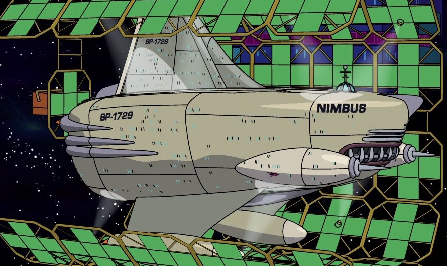

# Taxicab Numbers

## What is a taxicab number?
A positive integer which can be expressed as the sum of two positive cubes in at least two different ways.

```
n = a³ + b³ = c³ + d³
```

The concept was first mentioned in 1657 by Bernard Frénicle de Bessy, and was made famous and the name is derived from a conversation involving mathematicians G. H. Hardy and Srinivasa Ramanujan.

You may check it out first 3883 taxicab numbers at [taxicab-numbers.txt](taxicab-numbers.txt)

## What is Hardy-Ramanujan number?

1729 is the Hardy–Ramanujan number, named after a famous anecdote of the British mathematician G. H. Hardy regarding a visit to the hospital in about 1919 to see the Indian mathematician Srinivasa Ramanujan. In Hardy's words:

> I remember once going to see him when he was ill at Putney. I had ridden in taxi cab number 1729 and remarked that the number seemed to me rather a dull one, and that I hoped it was not an unfavorable omen. "No," he replied, "it is a very interesting number; it is the smallest number expressible as the sum of two cubes in two different ways."

The two different ways are:

```
1729 = 1³ + 12³ = 9³ + 10³
```


## Implementations

### Loop, calculate and compare based implementations

#### [TaxicabNumbers1](TaxicabNumbers1.java)

Four nested loops, brute-force implementation by looping though all combinations to find where a³ + b³ = c³ + d³

```
for "a" number
  loop though all numbers between 1 and maximum number
  calculate a³

for "b" number
  loop though all numbers between a number and maximum - a³ number
  calculate b³

for "c" number
  loop though all numbers between a + 1 number and a³ + b³ number
  calculate c³

for "d" number
  loop though all numbers between c number and a³ + b³ - c³ number
  calculate d³

if a³ + b³ equals to d³ + c³
  print
```

#### [TaxicabNumbers2](TaxicabNumbers2.java)

This is same as [TaxicabNumbers1](#taxicabnumbers1) implementation, but calculates d³ using Math.cbrt method, instead of looping though all posibble numbers.

```
for "a" number
  loop though all numbers between 1 and maximum number
  calculate a³

for "b" number
  loop though all numbers between a number and maximum - a³ number
  calculate b³

for "c" number
  loop though all numbers between a + 1 number and a³ + b³ number
  calculate c³

calculate d³ = a³ + b³ - c³ 
calculate d using Math.cbrt method
if d does not equal to a, b and greater than or equals to c
  print
```

#### [TaxicabNumbers3](TaxicabNumbers3.java)

This is same as [TaxicabNumbers2](#taxicabnumbers2) implementation, but calculates d³ using Math.pow method.

```
for "a" number
  loop though all numbers between 1 and maximum number
  calculate a³

for "b" number
  loop though all numbers between a number and maximum - a³ number
  calculate b³

for "c" number
  loop though all numbers between a + 1 number and a³ + b³ number
  calculate c³

calculate d³ = a³ + b³ - c³ 
calculate d using Math.pow method
if d does not equal to a, b and greater than or equals to c
  print
```

### Data structure based implementations

#### [TaxicabNumbers4](TaxicabNumbers4.java)
This implementation stores every combination of the sum of a³ + b³ (key) and [ a, b ] pairs (value) in a hash table, and checks it the sum (key) already in the table.

```
for "a" number
  loop though all numbers between 1 and maximum number
  calculate a³

for "b" number
  loop though all numbers between a number and maximum - a³ number
  calculate b³

check if table has sum of a³ and b³
  if yes and pair is not marked
    print
    mark the pair in the table
  if no
    put sum and pair into table
```

#### [TaxicabNumbers5](TaxicabNumbers5.java)
This is same as [TaxicabNumbers4](#taxicabnumbers4) implementation, but uses HashMap class.

```
for "a" number
  loop though all numbers between 1 and maximum number
  calculate a³

for "b" number
  loop though all numbers between a number and maximum - a³ number
  calculate b³

check if map has sum of a³ and b³
  if yes and pair is not marked
    print
    mark the pair in the map
  if no
    put sum and pair into map
```
## Performance

### 4 Loop vs 3 Loops
As expected, when we replace the fourth loop with the calculation d³ = a³ + b³ - c³, code compares values %40 to %90 less.

**X axis :** Maximum taxicab number to to calculate

**Y axis :** The number of times that the loop executes.

**Red line :** Four nested loops, brute-force implementation [TaxicabNumbers1](#taxicabnumbers1).

**Green line :** When we replace the fourth loop with the calculation d³ = a³ + b³ - c³

### Math.cbrt vs Math.pow
Although code executes 40% to 90% less, when we replace the fourth loop with the calculation d³ = a³ + b³ - c³, Math.cbrt and Math.pow methods are slower than looping though all combinations. Suprisingly Four nested loops, brute-force implementation [TaxicabNumbers1](#taxicabnumbers1) is faster than them.

It seems like Math.cbrt(x) method runs 6-9 nano seconds slower than Math.round(Math.pow(x, 1.0 / 3.0)). So when we run the code to the number 1,092,728, Math.cbrt implementaion [TaxicabNumbers2](#taxicabnumbers2) is 6,897,655
 nano seconds slower and Math.pow implementation  [TaxicabNumbers3](#taxicabnumbers3).

**X axis :** Maximum taxicab number to to calculate

**Y axis :** Execution time in nano seconds (1,000,000,000 nano seconds is 1 second)

**Red line :** [TaxicabNumbers2](#taxicabnumbers2) implementation which calculates d³ using Math.cbrt method.

**Blue line :** [TaxicabNumbers3](#taxicabnumbers3) implementation which calculates d³ using Math.pow method.

**Green line :** Four nested loops, brute-force implementation [TaxicabNumbers1](#taxicabnumbers1).

### HashTable vs HashMap
Data sutructure based implementations are way more efficient than [Loop, calculate and compare based implementations](#loop-calculate-and-compare-based-implementations)

However Hastable implementation [TaxicabNumbers4](#taxicabnumbers4) executes 474 to 204,179 nano seconds slower than HashMap impementation [TaxicabNumbers5](#taxicabnumbers5)

**X axis :** Maximum taxicab number to to calculate

**Y axis :** Execution time in nano seconds (1,000,000,000 nano seconds is 1 second)

**Red line :** [TaxicabNumbers4](#taxicabnumbers4) implementation which uses Hashtable class

**Green line :** [TaxicabNumbers5](#taxicabnumbers5) implementation which uses HashMap class

## Fun

### References throughout Futurama

#### The Nimbus's registration number is BP-1729.


Episode : Love's labour's lost in space (1999)

The Nimbus (registry BP-1729) is the flagship of the Democratic Order of Planets star fleet and has often been involved in various examples of galactic warfare and other governmental matters. Under the command of 25-Star General Zapp Brannigan, with Lieutenant Kif Kroker as his second in command, the Nimbus has been damaged by enemy forces on several occasions, but each time the ship has been rebuilt in time for Brannigan to lead it to unnecessary danger. 

#### In Xmas Story, Bender gets a card stating he is his mother's 1729th son.


Episode : Xmas story (1999)

Bender's mother is a robotic arm who works in a factory building bending units such as Bender and Flexo. Bender is her 1729th "son". She sent him a card for Xmas saying "Merry Xmas son #1729". In 3012, Bender told his son that he inherited his arm control software from her. She is, apparently, a religious fundamentalist, and never taught Bender about robot reproduction.

#### Bender and Flexo both have serial numbers that are the sum of two cubes.


Bender Bending Rodriguez (Model: bending unit 22) is a bending unit (Serial number is 2716057. This can be expressed as the sum of 2 cubes. Specifically, 952³ + (-951)³), who works at Planet Express as Assistant Manager of Sales, formerly chef of the company. He is one of the primary characters and is known for his "in-your-face interface". 

Flexo is a Bending Unit robot of model #22 (Serial Number is 3370318, a number expressible as the sum of two cubes (119³ + 119³)), the same model as and therefore identical to Bender in almost every possible respect, except that he has a stylish metal goatee attached.

Episode : The lesser of two evils (2000)

#### In The Farnsworth Parabox, one of the universes is Universe 1729.


Episode : The farnsworth parabox (2003)

The parallel universe where everyone has bobble-heads is called Universe 1729. Inhabitants say impolite things and speaking seems to set them in motion. The Parallel Universe Boxes here are pink.

#### A taxicab in Bender's Big Score is the number 87539319, which is the sum of two positive cubes in 3 ways.


Episode : Bender's big score (2007)

The number of the taxi (Chineese Checker Cab Co) Fry entered in 2012 is 87539319, which is the sum of two positive cubes in 3 ways. This is a reference to the incident with Hardy and Ramanujan. 
