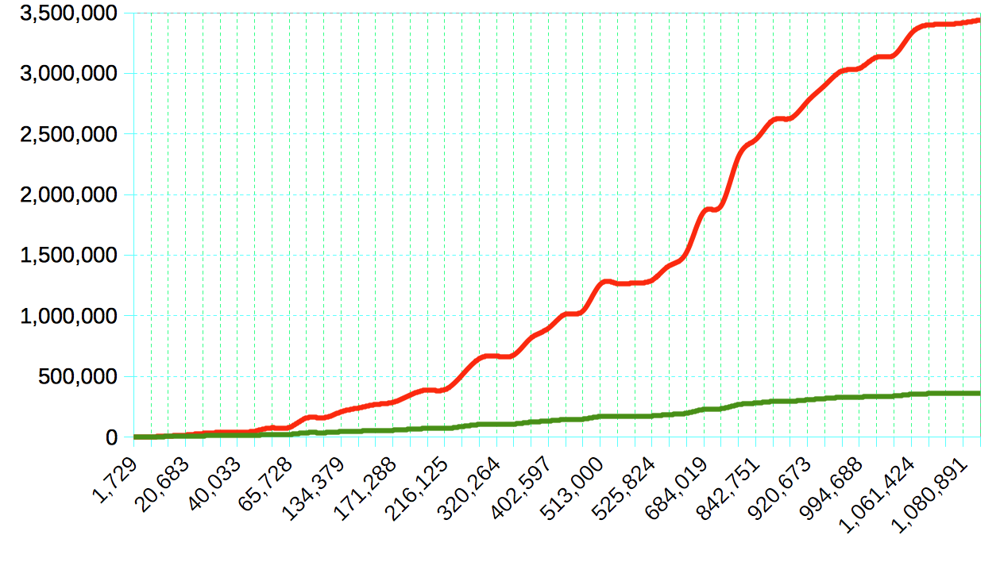

# Taxicab Numbers

## What is a taxicab number?
A positive integer which can be expressed as the sum of two positive cubes in at least two different ways.

```
n = a³ + b³ = c³ + d³
```

The concept was first mentioned in 1657 by Bernard Frénicle de Bessy, and was made famous and the name is derived from a conversation involving mathematicians G. H. Hardy and Srinivasa Ramanujan.

You may check it out first 3883 taxicab numbers at [taxicab-numbers.txt](taxicab-numbers.txt)

## What is Hardy-Ramanujan number?

1729 is the Hardy–Ramanujan number, named after a famous anecdote of the British mathematician G. H. Hardy regarding a visit to the hospital in about 1919 to see the Indian mathematician Srinivasa Ramanujan. In Hardy's words:

> I remember once going to see him when he was ill at Putney. I had ridden in taxi cab number 1729 and remarked that the number seemed to me rather a dull one, and that I hoped it was not an unfavorable omen. "No," he replied, "it is a very interesting number; it is the smallest number expressible as the sum of two cubes in two different ways."

The two different ways are:

```
1729 = 1³ + 12³ = 9³ + 10³
```

## Implementations

### Loop, calculate and compare based implementations

#### [TaxicabNumbers1](TaxicabNumbers1.java)

Four nested loops, brute-force implementation by looping though all combinations to find where a³ + b³ = c³ + d³

```
for "a" number
  loop though all numbers between 1 and maximum number
  calculate a³

for "b" number
  loop though all numbers between a number and maximum - a³ number
  calculate b³

for "c" number
  loop though all numbers between a + 1 number and a³ + b³ number
  calculate c³

for "d" number
  loop though all numbers between c number and a³ + b³ - c³ number
  calculate d³

if a³ + b³ equals to d³ + c³
  print
```

#### [TaxicabNumbers2](TaxicabNumbers2.java)

This is same as [TaxicabNumbers1](#taxicabnumbers1) implementation, but calculates d³ using Math.cbrt method, instead of looping though all posibble numbers.

```
for "a" number
  loop though all numbers between 1 and maximum number
  calculate a³

for "b" number
  loop though all numbers between a number and maximum - a³ number
  calculate b³

for "c" number
  loop though all numbers between a + 1 number and a³ + b³ number
  calculate c³

for "d" number
  calculate d³ = a³ + b³ - c³ 
  calculate d using Math.cbrt method

if d does not equal to a, b and greater than or equals to c
  print
```


#### [TaxicabNumbers3](TaxicabNumbers3.java)

This is same as [TaxicabNumbers2](#taxicabnumbers2) implementation, but calculates d³ using Math.pow method.

```
for "a" number
  loop though all numbers between 1 and maximum number
  calculate a³

for "b" number
  loop though all numbers between a number and maximum - a³ number
  calculate b³

for "c" number
  loop though all numbers between a + 1 number and a³ + b³ number
  calculate c³

for "d" number
  calculate d³ = a³ + b³ - c³ 
  calculate d using Math.pow method

if d does not equal to a, b and greater than or equals to c
  print
```

### Data structure based implementations

#### TaxicabNumbers4.java

#### TaxicabNumbers5.java

## Performance

### 4 Loop vs 3 Loops



**X axis :** Maximum number to reach

**Y axis :** The number of times that the loop executes.

**Red line :** Four nested loops, brute-force implementation [TaxicabNumbers1](#taxicabnumbers1).

**Green line :** When we replace the fourth loop with the calculation d³ = a³ + b³ - c³

### Math.cbrt vs Math.pow


**X axis :** Maximum number to reach

**Y axis :** Execution time in nano seconds (1,000,000,000 nano seconds is 1 second)

**Red line :** [TaxicabNumbers2](#taxicabnumbers2) implementation which calculates d³ using Math.cbrt method.

**Red line :** [TaxicabNumbers3](#taxicabnumbers3) implementation which calculates d³ using Math.pow method.

**Green line :** Four nested loops, brute-force implementation [TaxicabNumbers1](#taxicabnumbers1).

### HashTable vs HashMap


